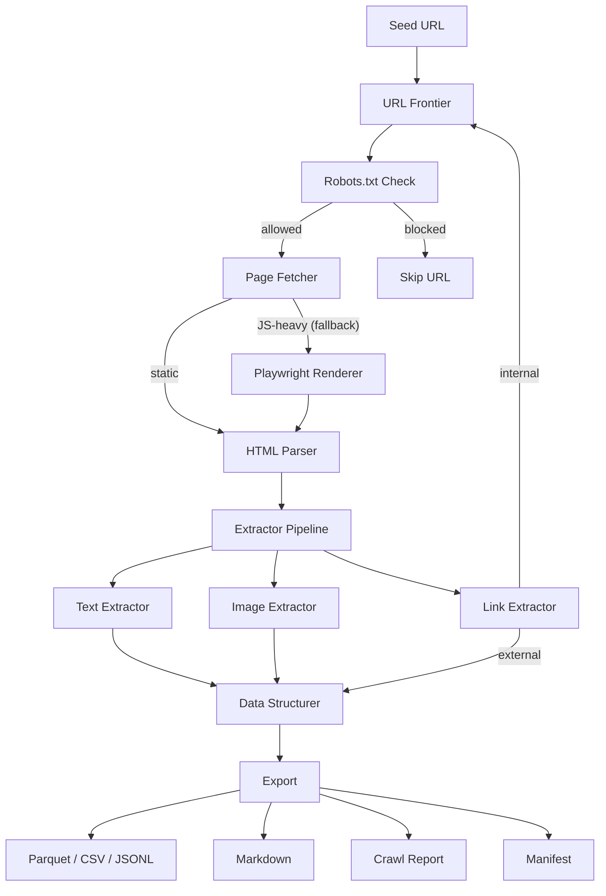

# Architecture

This page describes the internal design of the pipeline, the role of each module, and the Docker deployment configuration.

---

## Pipeline Flow

The crawl lifecycle follows a linear pipeline from URL discovery through data export.



1. The **seed URL** is added to the frontier at depth 0.
2. The **frontier** manages the BFS queue, normalizes URLs, filters by domain, and prevents revisits.
3. **Robots.txt** rules are checked per-domain (cached). Blocked URLs are skipped.
4. The **fetcher** makes an async HTTP request. If the response appears JavaScript-heavy (low text-to-HTML ratio), it falls back to Playwright/Chromium.
5. The **parser** strips scripts, styles, and non-content elements, then uses `readability-lxml` to extract the main content.
6. The **extractor pipeline** runs three extractors in sequence: text (title, headings, meta, body), images (download and deduplicate), and links (classify internal vs. external, filter noise).
7. Internal links are enqueued back into the frontier at `depth + 1`.
8. All extracted data accumulates in the **structurer**, which exports datasets at the end of the crawl.

---

## Module Overview

```
main.py                         Entry point (CLI + API router)
app/
├── api.py                      FastAPI REST interface
├── job_manager.py              Job orchestration and lifecycle
├── crawler.py                  BFS crawl loop
├── fetcher.py                  Async HTTP client + Playwright fallback
├── frontier.py                 URL queue, normalization, deduplication
├── robots.py                   Robots.txt fetching and rule checking
├── parser.py                   HTML parsing with readability-lxml
├── structurer.py               Data aggregation and dataset export
├── raw_storage.py              Gzip HTML archival with metadata
├── dataset_storage.py          Manifest creation and ZIP packaging
├── config.py                   Pydantic configuration models
├── logger.py                   Structured logging via structlog
└── extractors/
    ├── __init__.py             Pipeline orchestrator
    ├── text.py                 Title, headings, meta extraction
    ├── link.py                 Link classification and filtering
    └── image.py                Image download and deduplication
```

### Core Modules

**`job_manager.py`** -- Validates inputs, builds a `CrawlConfig`, creates the output directory, launches the crawler, triggers export, and creates the manifest. This is the top-level orchestrator called by both the CLI and API.

**`crawler.py`** -- Implements the BFS loop. Pops URLs from the frontier, checks robots.txt, fetches, parses, extracts, and enqueues discovered links. Tracks progress with a Rich progress bar.

**`fetcher.py`** -- Async HTTP client using `aiohttp`. Supports user-agent rotation, rate limiting (enforced via semaphore and sleep), and retries with exponential backoff. Detects JavaScript-heavy pages by heuristic and falls back to Playwright/Chromium.

**`frontier.py`** -- Priority queue (heapq) ordered by depth for BFS traversal. Normalizes URLs (lowercase host, strip fragments, remove tracking parameters like `utm_*`, `fbclid`, `gclid`). Maintains a visited set using SHA-256 hashes.

**`parser.py`** -- Strips non-content tags (script, style, noscript, iframe, svg). Detects encoding with `chardet`. Uses `readability-lxml` for main content extraction, with a fallback to the full body if readability is too aggressive.

**`structurer.py`** -- Accumulates page records, image metadata, external links, and errors during the crawl. At export time, builds Pandas DataFrames and writes to Parquet, CSV, or JSONL. Also generates the crawl report JSON and human-readable Markdown exports.

### Extractors

**`text.py`** -- Extracts the page title (from `<title>` or first `<h1>`), all headings (h1--h6 with levels), and the meta description (from `<meta name="description">` or `og:description`).

**`link.py`** -- Resolves relative URLs, classifies links as internal or external based on domain, and filters noise (login pages, admin paths, social media, mailto/tel links, binary files).

**`image.py`** -- Finds images via `` tags (including `data-src` and `data-lazy-src` attributes). Downloads asynchronously, filters by minimum dimension, deduplicates using perceptual hashing (`imagehash`), and stores files named by SHA-256 content hash.

---

## Docker Configuration

### Container

The Dockerfile uses a multi-stage build on `python:3.11-slim`:

1. **Builder stage** -- Installs build dependencies and compiles Python packages.
2. **Runtime stage** -- Copies compiled packages, installs runtime system libraries (libxml2, libjpeg, libpng, Chromium dependencies, fonts), and installs the Playwright Chromium browser.

The container exposes port `8000` and uses `/entrypoint.sh` as its entrypoint.

### Docker Compose

The `docker-compose.yml` defines a single service:

| Setting | Value |
|---|---|
| Container name | `web-crawler-api` |
| Default command | `serve` |
| Port mapping | `8000:8000` |
| Memory limit | 2 GB (512 MB reserved) |
| Restart policy | `unless-stopped` |
| Health check | HTTP request to `localhost:8000` every 30 seconds |

### Volumes

| Mount | Container Path | Purpose |
|---|---|---|
| `crawler_data` (named volume) | `/app/jobs` | Persistent storage for API job data |
| Host Downloads folder | `/app/downloads` | Bind mount for CLI crawl output |

### Environment Variables

| Variable | Default | Description |
|---|---|---|
| `PIPELINE_DATA_DIR` | `/app/jobs` | Base directory for API job storage |
| `PORT` | `8000` | API server port |
| `WORKERS` | `1` | Number of Uvicorn worker processes |
| `PYTHONUNBUFFERED` | `1` | Disable Python output buffering |
| `PURUCRAWLER_DOWNLOADS` | *(user-specific)* | Host path for the Downloads bind mount |

---

## Dependencies

| Package | Role |
|---|---|
| aiohttp | Async HTTP client for page fetching |
| beautifulsoup4 + lxml | HTML parsing and DOM traversal |
| readability-lxml | Main content extraction from HTML |
| pandas + pyarrow | DataFrame operations and Parquet export |
| Pillow + imagehash | Image processing and perceptual deduplication |
| playwright | Headless Chromium for dynamic page rendering |
| fastapi + uvicorn | REST API server |
| typer + rich | CLI framework and terminal formatting |
| structlog | Structured, key-value logging |
| pydantic | Configuration validation and serialization |
| chardet | Character encoding detection |
