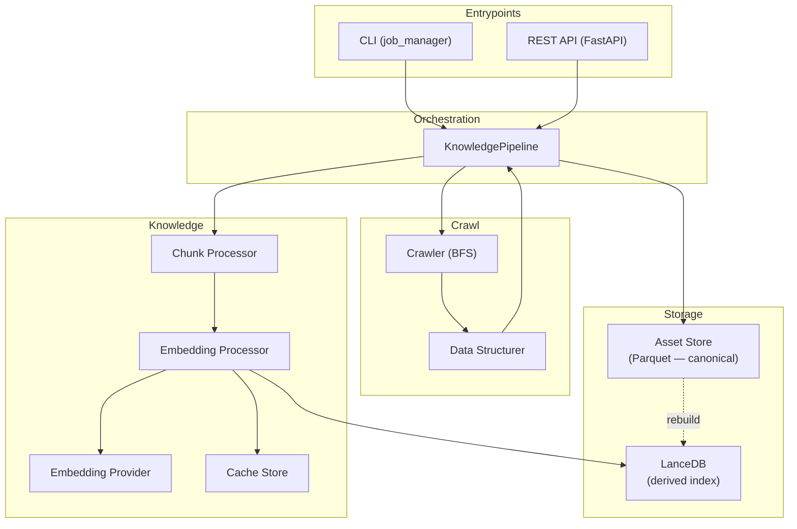
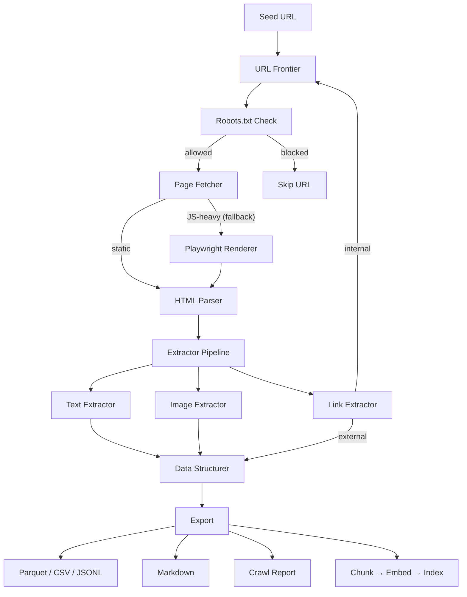
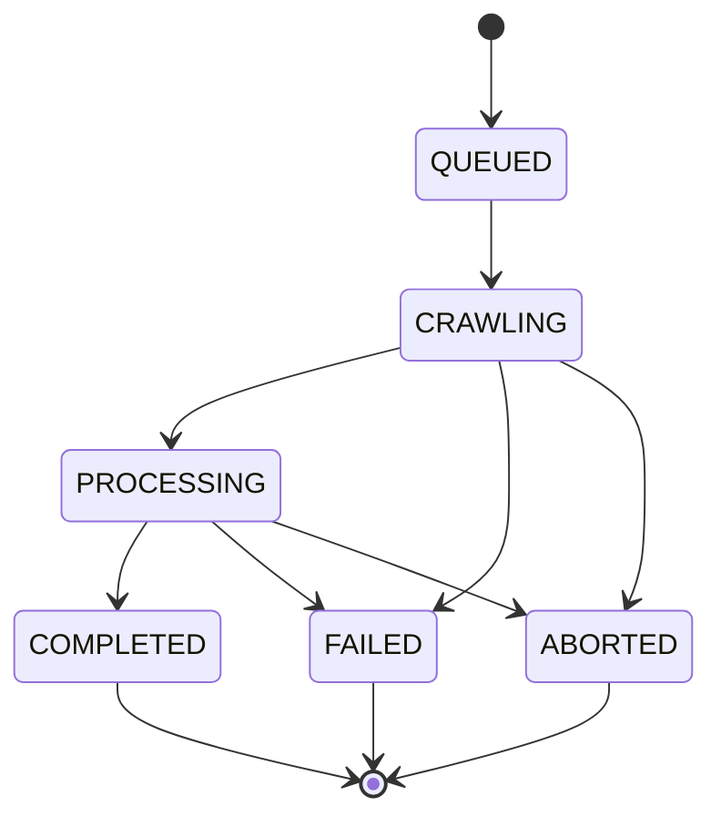
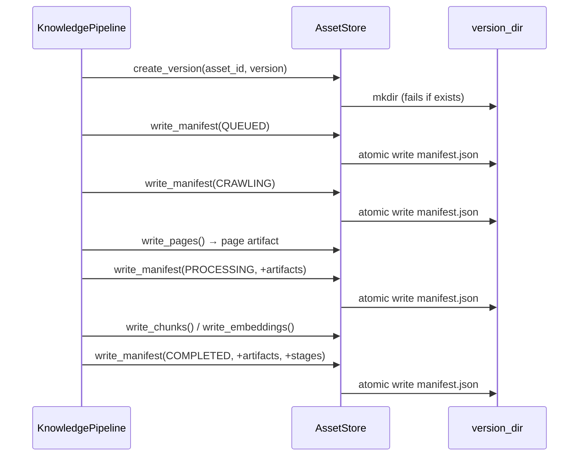
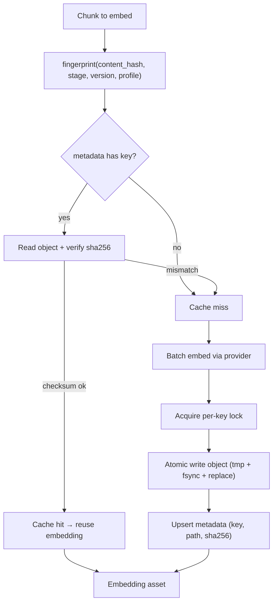

# Architecture

Diagrams only. Rationale and implementation notes belong in the source and in
ADRs, not here.

---

## System Architecture

```mermaid
flowchart TB
    subgraph Entrypoints
        CLI["CLI (job_manager)"]
        API["REST API (FastAPI)"]
    end

    subgraph Orchestration
        KP["KnowledgePipeline"]
    end

    subgraph Crawl
        Crawler["Crawler (BFS)"]
        Structurer["Data Structurer"]
    end

    subgraph Knowledge
        Chunk["Chunk Processor"]
        Embed["Embedding Processor"]
        Provider["Embedding Provider"]
        Cache["Cache Store"]
    end

    subgraph Storage
        Assets["Asset Store\n(Parquet — canonical)"]
        Vectors["LanceDB\n(derived index)"]
    end

    CLI --> KP
    API --> KP
    KP --> Crawler --> Structurer --> KP
    KP --> Chunk --> Embed
    Embed --> Provider
    Embed --> Cache
    KP --> Assets
    Embed --> Vectors
    Assets -. rebuild .-> Vectors
```

---

## Processing Flow

```mermaid
flowchart TD
    Seed["Seed URL"] --> Frontier["URL Frontier"]
    Frontier --> RobotsCheck["Robots.txt Check"]
    RobotsCheck -->|allowed| Fetcher["Page Fetcher"]
    RobotsCheck -->|blocked| Skip["Skip URL"]
    Fetcher -->|static| Parser["HTML Parser"]
    Fetcher -->|"JS-heavy (fallback)"| Playwright["Playwright Renderer"]
    Playwright --> Parser
    Parser --> Extractors["Extractor Pipeline"]
    Extractors --> TextExtractor["Text Extractor"]
    Extractors --> ImageExtractor["Image Extractor"]
    Extractors --> LinkExtractor["Link Extractor"]
    TextExtractor --> Structurer["Data Structurer"]
    ImageExtractor --> Structurer
    LinkExtractor -->|internal| Frontier
    LinkExtractor -->|external| Structurer
    Structurer --> Export["Export"]
    Export --> Parquet["Parquet / CSV / JSONL"]
    Export --> Readable["Markdown"]
    Export --> Report["Crawl Report"]
    Export --> ChunkStage["Chunk → Embed → Index"]
```

---

## Asset Lifecycle

```mermaid
stateDiagram-v2
    [*] --> QUEUED
    QUEUED --> CRAWLING
    CRAWLING --> PROCESSING
    PROCESSING --> COMPLETED
    COMPLETED --> [*]

    CRAWLING --> FAILED
    PROCESSING --> FAILED
    CRAWLING --> ABORTED
    PROCESSING --> ABORTED
    FAILED --> [*]
    ABORTED --> [*]
```

---

## Manifest Lifecycle

```mermaid
sequenceDiagram
    participant P as KnowledgePipeline
    participant S as AssetStore
    participant D as version_dir

    P->>S: create_version(asset_id, version)
    S->>D: mkdir (fails if exists)
    P->>S: write_manifest(QUEUED)
    S->>D: atomic write manifest.json
    P->>S: write_manifest(CRAWLING)
    S->>D: atomic write manifest.json
    P->>S: write_pages() → page artifact
    P->>S: write_manifest(PROCESSING, +artifacts)
    S->>D: atomic write manifest.json
    P->>S: write_chunks() / write_embeddings()
    P->>S: write_manifest(COMPLETED, +artifacts, +stages)
    S->>D: atomic write manifest.json
```

---

## Cache Flow

```mermaid
flowchart TD
    Start["Chunk to embed"] --> FP["fingerprint(content_hash, stage, version, profile)"]
    FP --> Meta{"metadata has key?"}
    Meta -->|no| Miss["Cache miss"]
    Meta -->|yes| Read["Read object + verify sha256"]
    Read -->|checksum ok| Hit["Cache hit → reuse embedding"]
    Read -->|mismatch| Miss
    Miss --> Batch["Batch embed via provider"]
    Batch --> Lock["Acquire per-key lock"]
    Lock --> WriteObj["Atomic write object (tmp + fsync + replace)"]
    WriteObj --> WriteMeta["Upsert metadata (key, path, sha256)"]
    Hit --> Done["Embedding asset"]
    WriteMeta --> Done
```
